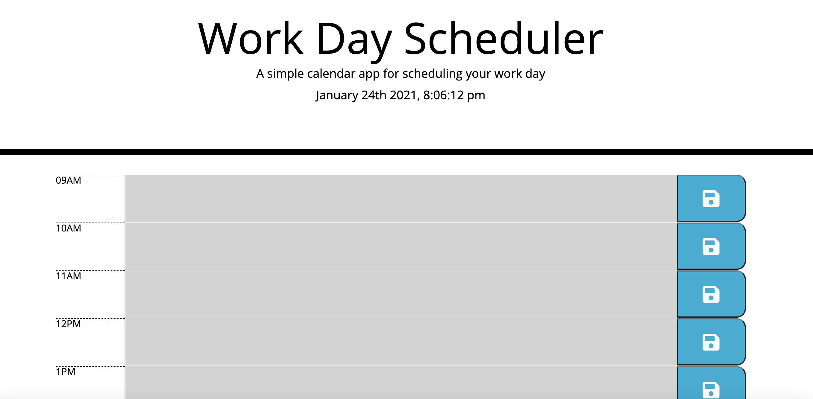

# Event Scheduler:
Log your days events with the scheduler. Type in your event during each hour block and click save to keep them there.

# How to Use:
Type the name of your event within the hour block it is occuring. Hit the save button to save the event.
To clear the event, highlight the event and backspace then click save to update your changes.

## Deployed Application Link

[https://hannamunoz.github.io/java.quiz/](https://hannamunoz.github.io/java.quiz/)